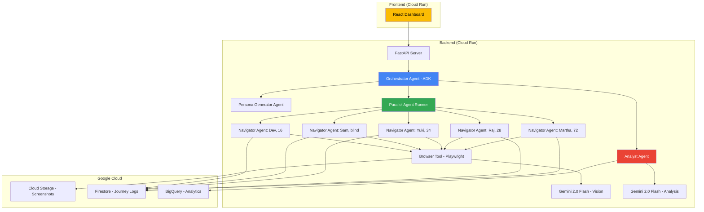

# 🏗️ Parallax — Complete 5-Day Execution Plan

> **Deadline:** March 7, 2026 (5 days from now)
> **Start:** March 3, 2026 (tomorrow)

---

## 📐 Architecture Overview



---

## 🛠️ Tech Stack

| Component          | Technology                             | Why                                                       |
| ------------------ | -------------------------------------- | --------------------------------------------------------- |
| Agent Framework    | **Google ADK (Agent Development Kit)** | Required by hackathon, supports ParallelAgent             |
| AI Model           | **Gemini 2.0 Flash**                   | Fast vision analysis, cost-effective for many screenshots |
| Browser Automation | **Playwright (Python)**                | Headless screenshots + click-at-coordinates + type        |
| Backend API        | **FastAPI**                            | Fast, async Python, easy Cloud Run deployment             |
| Frontend           | **React + Vite**                       | Quick dashboard for results visualization                 |
| Cloud Hosting      | **Cloud Run**                          | Serverless, auto-scaling, easy deploy                     |
| Screenshot Storage | **Cloud Storage**                      | Persistent, cheap, serves images to dashboard             |
| Journey Logs       | **Firestore**                          | Real-time, document-based, perfect for journey steps      |
| Analytics          | **BigQuery**                           | Cross-persona aggregation queries                         |
| IaC (Bonus Points) | **Terraform**                          | Automated deployment script                               |

---

## 🎯 Demo Strategy — Which Websites to Test

> [!IMPORTANT]
> You need websites that are **publicly accessible (no login required)**, **universally known**, and have **genuine UX issues** that diverse personas will discover differently.

### Primary Demo Targets

#### 1. 🏥 **healthcare.gov** — The "Wow Factor" Target

- **Why:** Notoriously complex, government site, universal relevance in the US
- **Test task:** _"Find out if you're eligible for health insurance and start an application"_
- **Expected findings:**
  - Martha (72): Can't find the "Get Coverage" button among dense text
  - Yuki (ESL): Confused by insurance jargon "marketplace," "premium," "deductible"
  - Sam (screen reader): Navigation structure is chaotic
  - Dev (16): Gives up after 2 clicks — too much text, no visual engagement
- **Demo impact:** Healthcare access is a universal concern — judges relate immediately

#### 2. 📰 **Wikipedia** — The "Baseline" Target

- **Why:** Everyone knows it, relatively good UX (proves agents aren't just negativity machines — they should find FEWER issues here)
- **Test task:** _"Find information about climate change and navigate to a related topic"_
- **Expected findings:**
  - Martha: Finds it readable but table of contents is overwhelming
  - Raj: Discovers keyboard shortcuts quickly, efficient navigation
  - Sam: Actually works decently with screen readers (positive finding!)
- **Demo impact:** Shows the system is calibrated — doesn't just flag everything as bad

#### 3. 🛒 **Your Own Intentionally Flawed E-Commerce App** — The "Controlled Demo"

- **Why:** You control the UX flaws, making the demo **predictable and impressive**
- **Build:** A simple 3-page e-commerce app with deliberate UX antipatterns:
  - Tiny, unlabeled hamburger menu
  - "Buy Now" button that's the same color as the background
  - Form labels that use jargon ("SKU Quantity" instead of "How many?")
  - No keyboard navigation support
  - Text that's too small on mobile viewports
- **Test task:** _"Find a product and complete a purchase"_
- **Demo impact:** You can GUARANTEE every persona finds different issues, making the demo foolproof

> [!TIP]
> **Demo order:** Start with YOUR flawed app (guaranteed wow), then healthcare.gov (real-world impact), then mention Wikipedia works well (proves calibration). This narrative arc shows the tool works on any site.

---

## 👥 The 7 Personas (Pre-Built)

```python
PERSONAS = [
    {
        "name": "Martha",
        "age": 72,
        "background": "Retired schoolteacher. Uses iPad for email and Facebook only.",
        "tech_level": 2,
        "cognitive_model": {
            "reads_all_text": True,           # Won't skip content
            "understands_icons": False,        # Needs text labels
            "typing_speed": "very_slow",       # ~15 WPM
            "scrolls_naturally": False,        # May not know to scroll
            "knows_hamburger_menu": False,     # Will look for visible nav
            "frustration_threshold": 3,        # Gives up after 3 failed attempts
            "click_precision": "low",          # May misclick small targets
        },
        "task_approach": "Reads everything carefully, looks for familiar words, avoids unfamiliar icons",
    },
    {
        "name": "Raj",
        "age": 28,
        "background": "Senior software engineer. Power user of every app.",
        "tech_level": 10,
        "cognitive_model": {
            "reads_all_text": False,           # Scans quickly
            "understands_icons": True,
            "typing_speed": "very_fast",
            "scrolls_naturally": True,
            "knows_hamburger_menu": True,
            "frustration_threshold": 8,        # Patient with complex UIs
            "tries_keyboard_first": True,      # Ctrl+K, Tab, shortcuts
            "click_precision": "high",
        },
        "task_approach": "Tries keyboard shortcuts first, scans for patterns, expects search functionality",
    },
    {
        "name": "Yuki",
        "age": 34,
        "background": "Marketing manager from Tokyo. English is second language.",
        "tech_level": 7,
        "cognitive_model": {
            "reads_all_text": True,            # Needs to carefully read English
            "understands_icons": True,
            "english_proficiency": "intermediate",
            "confused_by_idioms": True,        # "Checkout" might confuse
            "confused_by_jargon": True,        # "Deductible", "Premium"
            "frustration_threshold": 5,
            "click_precision": "high",
        },
        "task_approach": "Reads carefully, uses visual cues, may misinterpret English idioms or colloquialisms",
    },
    {
        "name": "Sam",
        "age": 40,
        "background": "Accountant. Legally blind, uses screen reader (JAWS).",
        "tech_level": 6,
        "cognitive_model": {
            "uses_screen_reader": True,
            "navigates_by_headings": True,     # H1, H2, H3 structure matters
            "needs_alt_text": True,
            "ignores_visual_cues": True,       # Color, size, position irrelevant
            "relies_on_tab_order": True,
            "frustration_threshold": 6,
            "keyboard_only": True,
        },
        "task_approach": "Navigates by heading structure and tab order. Ignores all visual design. Needs descriptive link text.",
    },
    {
        "name": "Dev",
        "age": 16,
        "background": "High school student. Lives on TikTok and Instagram.",
        "tech_level": 8,
        "cognitive_model": {
            "reads_all_text": False,           # Skims aggressively
            "attention_span": "very_short",    # Gives up fast if bored
            "expects_visual_design": True,     # Plain text = boring = leave
            "scrolls_naturally": True,
            "frustration_threshold": 2,        # Lowest patience
            "expects_instant_feedback": True,
            "click_precision": "high",
        },
        "task_approach": "Scrolls fast, taps first colorful thing, expects instant results, leaves if page looks 'old'",
    },
    {
        "name": "Priya",
        "age": 55,
        "background": "Small business owner. Uses phone primarily, rarely desktop.",
        "tech_level": 4,
        "cognitive_model": {
            "mobile_first": True,
            "confused_by_desktop_layouts": True,
            "reads_all_text": True,
            "understands_icons": "partially",
            "frustration_threshold": 4,
            "expects_large_buttons": True,
            "click_precision": "medium",
        },
        "task_approach": "Expects mobile-like large touch targets. Gets lost in complex desktop layouts with many columns.",
    },
    {
        "name": "Carlos",
        "age": 45,
        "background": "Construction worker. Colorblind (deuteranopia). Calloused fingers.",
        "tech_level": 3,
        "cognitive_model": {
            "colorblind": "deuteranopia",      # Red-green colorblind
            "cannot_distinguish": ["red/green", "orange/green"],
            "needs_non_color_cues": True,      # Relies on shapes/text, not color
            "click_precision": "low",          # Large fingers
            "frustration_threshold": 4,
            "reads_all_text": True,
        },
        "task_approach": "Cannot rely on color-coded information. Needs large click targets. May miss red error messages.",
    },
]
```

---

## 📁 Project Structure

```
pallax/
├── README.md                    # Spin-up instructions (judges need this!)
├── pyproject.toml               # Python project config
├── requirements.txt
├── .env.example                 # GOOGLE_API_KEY, GCP_PROJECT_ID
│
├── agents/                      # ADK Agent definitions
│   ├── __init__.py
│   ├── orchestrator.py          # Root agent — runs the full pipeline
│   ├── persona_generator.py     # Generates/loads persona profiles
│   ├── navigator.py             # Core agent — sees + acts on screenshots
│   ├── analyst.py               # Aggregates journeys, finds patterns
│   └── report_generator.py      # Creates structured UX report
│
├── personas/
│   ├── __init__.py
│   ├── definitions.py           # The 7 persona definitions above
│   └── cognitive.py             # Cognitive model logic
│
├── tools/                       # ADK Tools (Playwright wrappers)
│   ├── __init__.py
│   ├── browser.py               # Screenshot, click, type, scroll, navigate
│   └── storage.py               # Upload screenshot to Cloud Storage
│
├── models/
│   ├── __init__.py
│   ├── journey.py               # Journey step data model
│   ├── finding.py               # UX issue finding model
│   └── report.py                # Final report model
│
├── api/
│   ├── __init__.py
│   ├── main.py                  # FastAPI app
│   ├── routes.py                # POST /test, GET /results/{id}
│   └── websocket.py             # Live progress streaming
│
├── frontend/                    # React dashboard
│   ├── package.json
│   ├── src/
│   │   ├── App.jsx
│   │   ├── components/
│   │   │   ├── TestRunner.jsx   # Start a new test
│   │   │   ├── LiveFeed.jsx     # Real-time persona progress
│   │   │   ├── JourneyView.jsx  # Step-by-step journey replay
│   │   │   ├── HeatMap.jsx      # Where personas got stuck
│   │   │   └── ReportView.jsx   # Final aggregated report
│   │   └── styles/
│   └── vite.config.js
│
├── demo-app/                    # Intentionally flawed e-commerce app
│   ├── index.html
│   ├── products.html
│   ├── checkout.html
│   └── styles.css
│
├── cloud/                       # Google Cloud deployment
│   ├── Dockerfile
│   ├── cloudbuild.yaml
│   ├── terraform/               # IaC for bonus points
│   │   ├── main.tf
│   │   ├── variables.tf
│   │   └── outputs.tf
│   └── deploy.sh
│
├── docs/
│   ├── architecture.png         # Architecture diagram for submission
│   └── demo-script.md
│
└── tests/                       # Basic tests
    ├── test_navigator.py
    └── test_personas.py
```

---

## 📅 Day-by-Day Execution Plan

### Day 1 (March 3) — Core Agent Loop 🔧

**Goal:** A single persona agent can screenshot → analyze → act on a real website.

| Time           | Task                                                                                                                                                           | Output                                                  |
| -------------- | -------------------------------------------------------------------------------------------------------------------------------------------------------------- | ------------------------------------------------------- |
| Morning (3h)   | Set up project: Python env, ADK install, Playwright install, GCP project, Gemini API key                                                                       | Working dev environment                                 |
| Midday (2h)    | Build `tools/browser.py`: Playwright wrapper with `screenshot()`, `click(x, y)`, `type_text(selector_description, text)`, `scroll(direction)`, `navigate(url)` | Tested browser tools                                    |
| Afternoon (3h) | Build `agents/navigator.py`: Single persona agent that takes screenshots, sends to Gemini Vision, decides next action, executes it                             | **MILESTONE: Martha navigating a website autonomously** |
| Evening (2h)   | Build `personas/definitions.py` with all 7 personas. Test navigator with 2-3 different personas on a simple website.                                           | Verified persona behavior differs                       |

**Key code to write:**

```python
# tools/browser.py — Core browser interaction tool
from playwright.async_api import async_playwright
from google.cloud import storage
import base64

class BrowserTool:
    async def setup(self, viewport_width=1280, viewport_height=720):
        self.playwright = await async_playwright().start()
        self.browser = await self.playwright.chromium.launch(headless=True)
        self.page = await self.browser.new_page(
            viewport={"width": viewport_width, "height": viewport_height}
        )

    async def navigate(self, url: str) -> bytes:
        await self.page.goto(url, wait_until="networkidle")
        return await self.screenshot()

    async def screenshot(self) -> bytes:
        """Returns screenshot as bytes for Gemini vision."""
        return await self.page.screenshot(type="png", full_page=False)

    async def click(self, x: int, y: int) -> bytes:
        """Click at coordinates and return new screenshot."""
        await self.page.mouse.click(x, y)
        await self.page.wait_for_load_state("networkidle", timeout=5000)
        return await self.screenshot()

    async def type_text(self, x: int, y: int, text: str) -> bytes:
        """Click a field and type text."""
        await self.page.mouse.click(x, y)
        await self.page.keyboard.type(text, delay=50)
        return await self.screenshot()

    async def scroll(self, direction: str = "down", amount: int = 300) -> bytes:
        """Scroll the page."""
        delta = amount if direction == "down" else -amount
        await self.page.mouse.wheel(0, delta)
        await self.page.wait_for_timeout(500)
        return await self.screenshot()
```

---

### Day 2 (March 4) — Multi-Agent + Parallel Execution 🤖🤖🤖

**Goal:** Multiple persona agents run in parallel, each logging their journey.

| Time           | Task                                                                                                                                                                   | Output                                                      |
| -------------- | ---------------------------------------------------------------------------------------------------------------------------------------------------------------------- | ----------------------------------------------------------- |
| Morning (3h)   | Build `agents/orchestrator.py` with ADK ParallelAgent. Wire up persona generation → parallel navigation → result collection.                                           | Multi-agent pipeline working                                |
| Midday (2h)    | Build `models/journey.py` and Firestore integration. Each navigator step is logged: screenshot URL, what agent "saw," what it decided, what it did, frustration level. | Journey logs in Firestore                                   |
| Afternoon (3h) | Build `agents/analyst.py`: Takes all journey logs, uses Gemini to identify cross-persona patterns, generates prioritized UX issues.                                    | **MILESTONE: Analyst finds "5/7 personas couldn't find X"** |
| Evening (2h)   | Test full pipeline on healthcare.gov and your demo app. Tune persona prompts for realistic behavior.                                                                   | End-to-end pipeline working                                 |

**Key code to write:**

```python
# agents/orchestrator.py — ADK multi-agent orchestration
from google.adk.agents import Agent, ParallelAgent, SequentialAgent
from agents.navigator import create_navigator_agent
from agents.analyst import AnalystAgent
from personas.definitions import PERSONAS

class ParallaxOrchestrator(SequentialAgent):
    def __init__(self, target_url: str, task: str, persona_count: int = 7):
        # Create navigator agents for each persona
        navigators = [
            create_navigator_agent(persona, target_url, task)
            for persona in PERSONAS[:persona_count]
        ]

        # Run all navigators in parallel
        parallel_navigation = ParallelAgent(
            name="parallel_testers",
            sub_agents=navigators,
        )

        # Then analyze results
        analyst = AnalystAgent()

        super().__init__(
            name="parallax_orchestrator",
            sub_agents=[parallel_navigation, analyst],
            description="Orchestrates persona-based UX testing"
        )
```

---

### Day 3 (March 5) — API + Frontend Dashboard 🖥️

**Goal:** Beautiful web dashboard showing real-time test progress and results.

| Time         | Task                                                                                                                                                                                 | Output                                                      |
| ------------ | ------------------------------------------------------------------------------------------------------------------------------------------------------------------------------------ | ----------------------------------------------------------- |
| Morning (3h) | Build `api/main.py` with FastAPI: `POST /test` (start test), `GET /results/{id}` (get report), WebSocket for live progress.                                                          | API serving results                                         |
| Midday (3h)  | Build frontend dashboard: Test Runner (enter URL + task), Live Feed (real-time persona progress with screenshots), Journey Replay (step-by-step), Report View (aggregated findings). | **MILESTONE: Beautiful dashboard showing agents in action** |
| Evening (2h) | Build the intentionally flawed demo e-commerce app (`demo-app/`). 3 pages with specific UX antipatterns.                                                                             | Demo app deployed                                           |

**Dashboard must show:**

1. **Live feed:** Each persona's current screenshot + their "thinking" in real-time
2. **Journey replay:** Click through each step of each persona's journey
3. **Heatmap:** Overlay showing where each persona clicked/got stuck
4. **Report:** Prioritized list of UX issues with severity + which personas were affected

---

### Day 4 (March 6) — Cloud Deployment + Polish ☁️

**Goal:** Everything running on Google Cloud. Demo-ready.

| Time           | Task                                                                                                                                       | Output                        |
| -------------- | ------------------------------------------------------------------------------------------------------------------------------------------ | ----------------------------- |
| Morning (3h)   | Dockerize backend (FastAPI + Playwright + ADK). Deploy to Cloud Run. Set up Cloud Storage, Firestore, BigQuery.                            | **MILESTONE: Working on GCP** |
| Midday (2h)    | Write Terraform scripts for automated deployment (bonus points!). Deploy frontend to Cloud Run or Firebase Hosting.                        | IaC in repo                   |
| Afternoon (2h) | Create architecture diagram (use draw.io or Mermaid). Take screenshots of Cloud Console proving deployment.                                | Architecture diagram ready    |
| Evening (3h)   | Run full demo on all 3 target websites. Fix any bugs. Tune persona prompts for best demo results. Save the best run results for the video. | Demo-ready results            |

---

### Day 5 (March 7) — Demo Video + Submission 🎬

**Goal:** Ship it. 4-minute video, all submission artifacts, blog post.

| Time           | Task                                                                                                    | Output             |
| -------------- | ------------------------------------------------------------------------------------------------------- | ------------------ |
| Morning (3h)   | Record demo video (script below). Multiple takes. Edit to exactly 3:50.                                 | Demo video         |
| Midday (2h)    | Write README with spin-up instructions. Write project description for Devpost.                          | Submission text    |
| Afternoon (2h) | Record Cloud deployment proof video. Publish blog post with #GeminiLiveAgentChallenge. Sign up for GDG. | Bonus points items |
| Evening (1h)   | Submit on Devpost. Double-check all requirements.                                                       | **SUBMITTED! 🚀**  |

---

## 🎬 Demo Video Script (3 minutes 50 seconds)

### Act 1: The Problem (0:00 – 0:35)

```
[Screen: Montage of bad UX — tiny buttons, confusing forms, error screens]

NARRATOR (you):
"97% of websites have usability issues. But here's the real problem —
QA teams all think alike. A 28-year-old engineer tests differently than
a 72-year-old retiree. A native English speaker navigates differently
than someone who speaks English as a second language. A sighted user
and a screen reader user have completely different experiences.

What if you could test your app with 7 completely different humans...
in 60 seconds?"
```

### Act 2: The Demo (0:35 – 2:30)

```
[Screen: Parallax dashboard — you enter your demo app's URL]

NARRATOR:
"This is Parallax. I'll paste in a URL and give the agents a task:
'Find a product and complete a purchase.' Let's watch."

[Screen: Live feed shows 7 personas starting simultaneously]
[Split screen: Martha slowly reading the page vs. Raj trying Ctrl+K]

"Watch Martha, age 72. She's reading every word on the page... and she
can't find the navigation. The hamburger icon means nothing to her.
She's clicking randomly."

[Screen: Martha's frustration counter climbing]

"After 3 failed attempts, she gives up. But look at Raj, our power
user — he found the search bar in 2 seconds using a keyboard shortcut."

[Screen: Yuki looking at "Checkout"]

"Yuki, our ESL user, read 'Checkout' as 'Check Out' — as in, look at
something. She clicked expecting product details, not payment."

[Screen: Sam's screen reader simulation]

"And Sam, who uses a screen reader, can't navigate at all — the heading
structure is completely flat. No H2s, no H3s."

[Screen: Analyst agent generating report]

"Now Parallax's Analyst Agent aggregates all 7 journeys and finds patterns:
'5 out of 7 personas couldn't find the navigation menu.
3 out of 7 misunderstood the checkout button.'
Each issue comes with a specific fix recommendation and severity score."
```

### Act 3: Real-World Impact (2:30 – 3:15)

```
[Screen: Parallax running on healthcare.gov]

"But this isn't just for demo apps. Here's Parallax running on
healthcare.gov — a site millions depend on. Martha couldn't find
how to check her eligibility. Carlos, who's colorblind, couldn't
see the red error messages. Dev, our 16-year-old, left after
10 seconds because the page looked 'old.'"

[Screen: Results dashboard with prioritized issues]

"Every finding is grounded in observed behavior — not opinions.
Every recommendation is actionable. And it all runs in under 2 minutes."
```

### Act 4: Architecture + Impact (3:15 – 3:50)

```
[Screen: Architecture diagram]

"Under the hood, Parallax uses Google ADK to orchestrate 7 independent
agents running in parallel. Each persona agent uses Gemini 2.0 Flash
to visually understand screenshots — no DOM, no CSS selectors —
and decides its next action based on its unique cognitive model.
A separate Analyst Agent identifies cross-persona patterns using
Gemini's reasoning capabilities. The entire backend runs on
Google Cloud Run with Firestore for journey logs and Cloud Storage
for screenshots.

Parallax: One click. 7 perspectives. Zero blind spots."
```

---

## ✅ Submission Checklist

| Requirement                         | Status | How                                          |
| ----------------------------------- | ------ | -------------------------------------------- |
| 📃 Text Description                 | ⬜     | Devpost project page                         |
| 👨‍💻 Public Code Repository           | ⬜     | GitHub repo (make public before submit)      |
| 📋 README with spin-up instructions | ⬜     | README.md with `docker-compose up`           |
| 🖥️ Proof of GCP Deployment          | ⬜     | Screen recording of Cloud Console            |
| 🏗️ Architecture Diagram             | ⬜     | Mermaid diagram rendered as PNG              |
| 📹 Demo Video (<4 min)              | ⬜     | Script above, record with OBS                |
| **Bonus: Blog Post**                | ⬜     | Medium/Dev.to with #GeminiLiveAgentChallenge |
| **Bonus: Automated Deployment**     | ⬜     | Terraform scripts in `cloud/terraform/`      |
| **Bonus: GDG Signup**               | ⬜     | Link to public GDG profile                   |

---

## ⚠️ Risk Mitigation

| Risk                                         | Likelihood | Mitigation                                                                                         |
| -------------------------------------------- | ---------- | -------------------------------------------------------------------------------------------------- |
| Gemini rate limits hit with many screenshots | High       | Use Gemini 2.0 Flash (cheaper, faster). Limit to 15 steps per persona. Cache repeated screenshots. |
| Personas behave too similarly                | Medium     | Make cognitive models very distinct in prompts. Test and iterate Day 1 evening.                    |
| Playwright gets blocked by websites          | Medium     | Use realistic user-agent strings. Add random delays. For demo, use your OWN app as primary target. |
| Cloud Run cold starts too slow               | Low        | Set minimum instances to 1. Use smaller Docker image.                                              |
| Full pipeline takes >5 min                   | Medium     | Run 5 personas in demo (not 7). Limit steps to 10 per persona. Pre-warm browser.                   |
| Dashboard looks ugly                         | Medium     | Use a pre-built component library (shadcn/ui). Spend dedicated time on Day 3.                      |

---

## 🏃 Quick Start Commands

```bash
# Day 1 — Project setup
mkdir Parallax && cd Parallax
python -m venv .venv && source .venv/bin/activate
pip install google-adk google-genai fastapi uvicorn playwright
playwright install chromium

# Set up GCP
gcloud auth login
gcloud config set project YOUR_PROJECT_ID
export GOOGLE_API_KEY="your-gemini-api-key"

# Run first test
python -m agents.navigator --persona martha --url "https://your-demo-app.com" --task "Find a product"
```

> [!CAUTION]
> **Time is tight.** If you're falling behind on Day 3, skip the fancy dashboard and use a simple HTML page with JSON output. The AGENTS are what judges care about — the dashboard is polish. Get the multi-agent pipeline working first, everything else is secondary.
